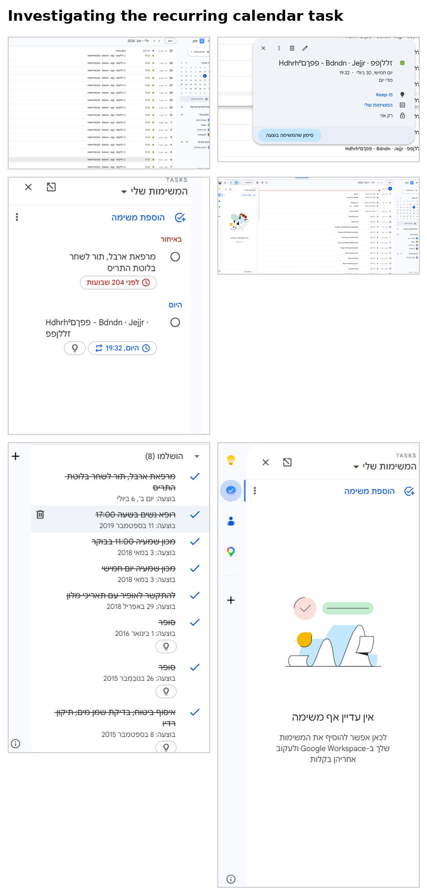
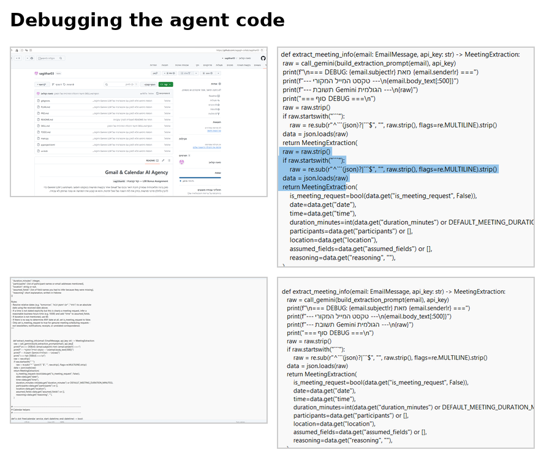
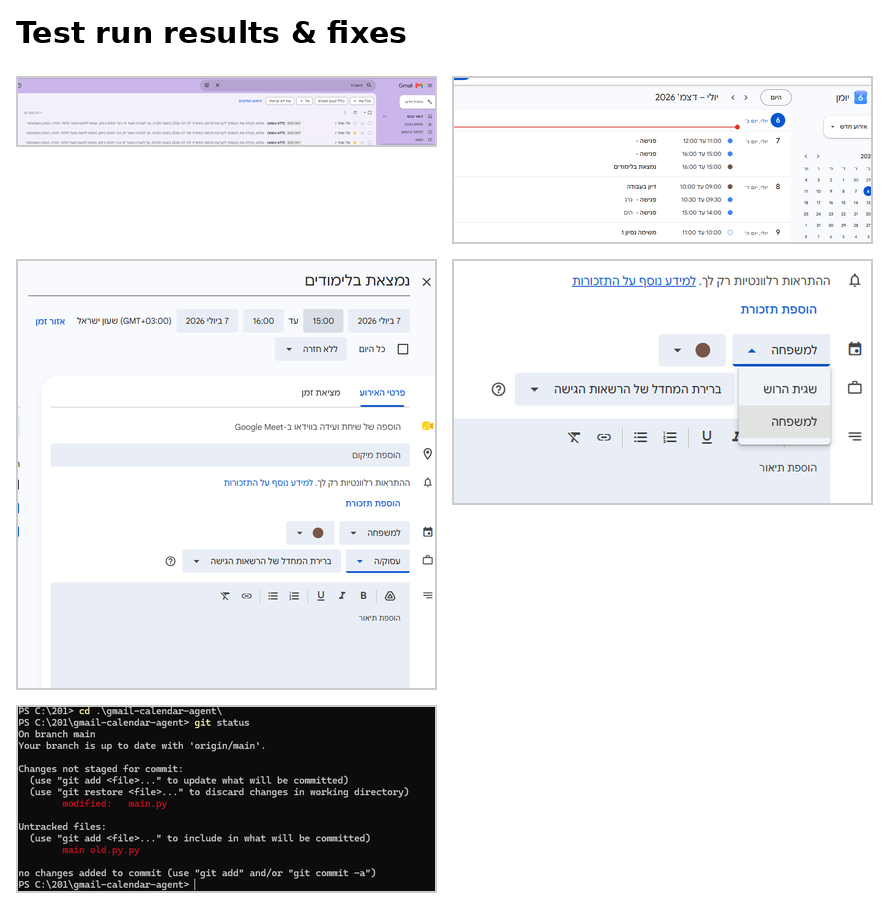

# Gmail & Calendar AI Agent

**L08 Bonus Assignment — Group code: `sagithar03`**

An AI agent that scans a Gmail inbox for free-text meeting requests, uses the
Gemini LLM to understand and extract meeting details, checks Google Calendar
availability, and either books the meeting or replies that the time doesn't
work.

See [`PRD.md`](./PRD.md) for full requirements, [`PLAN.md`](./PLAN.md) for the
development plan, and [`TODO.md`](./TODO.md) for task tracking.

## How it works

1. Authenticates with Google via OAuth 2.0 (Gmail + Calendar scopes).
2. Reads inbox messages from the last 48 hours (configurable).
3. Skips formal calendar-invite emails — only free-text requests are handled.
4. Sends each remaining email to Gemini (`gemini-2.5-flash`) to classify
   whether it's a genuine meeting request and, if so, extract date, time,
   duration, participants, and location.
5. Checks Calendar free/busy for the extracted slot.
6. **Free** → creates a Calendar event with full details.
   **Busy** → replies to the sender explaining the slot is unavailable.

## Setup

### 1. Prerequisites
- Python 3.10+
- [`uv`](https://astral.sh/uv) package manager
- A Google account (Gmail + Calendar)
- A free Gemini API key ([Google AI Studio](https://aistudio.google.com))

### 2. Google Cloud / OAuth setup
Full step-by-step instructions are in the course-provided setup guide
(Appendix A). Summary:
1. Create a Google Cloud project.
2. Enable **Gmail API** and **Google Calendar API**.
3. Configure the OAuth consent screen (External audience).
4. Add scopes: `gmail.modify`, `calendar`.
5. Create an OAuth Client of type **Desktop app**, download it, and save it
   as `credentials.json` in this folder.
6. Add your own email as a Test User (required while the app is in Testing
   mode).

### 3. Gemini API key
1. Go to [aistudio.google.com](https://aistudio.google.com).
2. Create an API key (free tier, no credit card required).
3. Create a file named `.env` in this folder with:
   ```
   GEMINI_API_KEY=your_key_here
   ```

### 4. Install dependencies
```bash
uv sync
```

### 5. Run
```bash
uv run main.py
```

On first run, a browser window opens for Google sign-in and consent. A
`token.json` file is created and reused on subsequent runs (no repeated
sign-in needed unless it expires or scopes change).

## Configuration

Edit the constants at the top of `main.py`:

| Constant | Default | Description |
|---|---|---|
| `LOOKBACK_HOURS` | `48` | How many hours back to scan the inbox |
| `GEMINI_MODEL` | `gemini-2.5-flash` | Which Gemini model to use |
| `DEFAULT_MEETING_DURATION_MINUTES` | `60` | Used when the email doesn't specify a duration |

## Security notes

The following files contain secrets and are **excluded from this repository**
via `.gitignore`:
- `credentials.json` — OAuth client secret
- `token.json` — personal access/refresh token
- `.env` — Gemini API key

To run this project yourself, you must generate your own copies of these
files following the setup steps above.

## Example run

```
Found 8 email(s) from the last 48 hours.

[created] '...' -> event 754q0c9rs9vg9pjlmskqi9qrug (https://www.google.com/calendar/event?eid=...)
[created] '...' -> event mrkcch971t2tu1e4fo95gh6i0c (https://www.google.com/calendar/event?eid=...)
[skip] 'ניוזלטר בעברית' - not a meeting request
[skip] 'SUMMER SALE ...' - no text body
[skip] 'Due on ...' - not a meeting request
[skip] 'Movistar Movil - Recibo Digital Julio 2026' - not a meeting request
[skip] 'Mejora tu experiencia móvil...' - not a meeting request
```

Out of 8 real inbox emails (in Hebrew, English, and Spanish), the agent
correctly identified 2 genuine meeting requests and booked them, while
correctly skipping newsletters, receipts, and unrelated correspondence.

## Screenshots


### Debugging session (July 2026)

Follow-up testing against a live inbox surfaced and fixed three real bugs
(Hebrew header encoding, single-calendar conflict checks, crash resilience) —
see [`SKILL.md`](./SKILL.md#known-limitations) for details.







## Project structure

```
.
├── main.py            # the agent
├── pyproject.toml      # dependencies
├── uv.lock             # locked dependency versions
├── PRD.md               # product requirements document
├── PLAN.md              # development plan
├── TODO.md              # task tracker
├── README.md            # this file
└── .gitignore           # excludes credentials.json, token.json, .env, etc.
```
